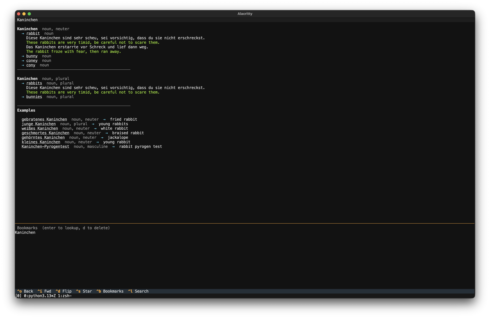

# Linguee API

> [!WARNING]
> This project was entirely generated by AI. Proceed accordingly. Also be a good sport and don't abuse their host. They have some super naïve CAPTCHA going on and I'd rather they keep it that way.

Unofficial JSON API proxy for [Linguee](https://www.linguee.com). Scrapes Linguee HTML and returns structured JSON for translations, examples, external sources, and autocompletions.



## Quick Start

```bash
uv venv && uv pip install -e .
uvicorn linguee_api.main:app --reload
```

Open http://localhost:8000/docs for interactive API docs.

## Endpoints

| Endpoint | Description |
|---|---|
| `GET /api/v2/translations` | Translations with examples |
| `GET /api/v2/examples` | Curated usage examples |
| `GET /api/v2/external_sources` | Real-world bilingual examples |
| `GET /api/v2/autocompletions` | Autocomplete suggestions |
| `GET /health` | Health check |

All endpoints accept `query`, `src`, and `dst` language code parameters.

**Supported languages**: bg, cs, da, de, el, en, es, et, fi, fr, hu, it, ja, lt, lv, mt, nl, pl, pt, ro, ru, sk, sl, sv, zh

## CLI

German-English dictionary TUI with clickable words, history, and bookmarks.

```bash
linguee
```

Install globally with `uv tool install .` or run from the project with `uv run linguee`.

Use `linguee --no-tui` for a simple REPL without the TUI.

| Key | Action |
|---|---|
| `ctrl+o` / `ctrl+i` | Back / forward in history |
| `ctrl+n` / `ctrl+p` | Navigate lists |
| `ctrl+d` | Flip direction (de↔en) |
| `ctrl+s` | Bookmark current word |
| `ctrl+b` | Show bookmarks |
| `ctrl+u` + vowel | Type umlauts (ä, ö, ü, ß) |
| `ctrl+l` | Focus search |
| `escape` | Close panel |

History and bookmarks are stored in `~/.local/share/linguee/`. Lookups are cached in `~/.cache/linguee/`.

## Configuration

Environment variables (prefix `LINGUEE_`):

| Variable | Default | Description |
|---|---|---|
| `LINGUEE_REDIS_URL` | - | Redis URL (optional, falls back to in-memory) |
| `LINGUEE_CACHE_TTL` | 86400 | Cache TTL in seconds |
| `LINGUEE_LOG_LEVEL` | INFO | Log level |
| `LINGUEE_LOG_FORMAT` | console | `console` or `json` |
| `LINGUEE_SENTRY_DSN` | - | Sentry DSN (optional) |
| `LINGUEE_RATE_LIMIT` | 30/minute | Per-IP rate limit |
| `LINGUEE_API_KEY` | - | API key for authentication (optional) |
